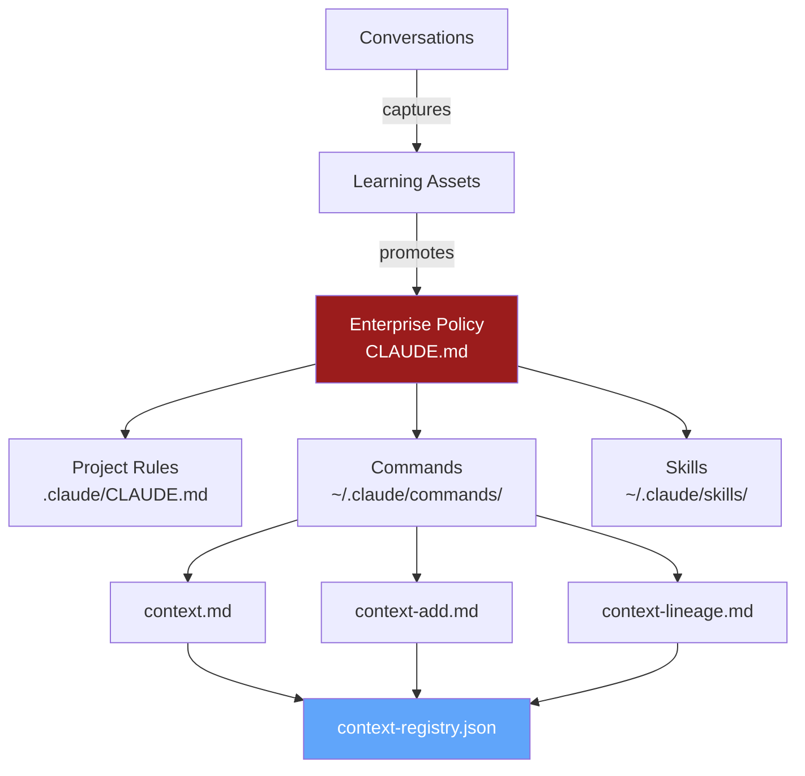

# Context Lineage

View and manage dependencies between context assets. Essential for impact analysis and context evolution.

## Purpose

**Context Lineage** tracks:
- What context depends on other context
- What would break if context changes
- How context flows through the system
- Origin and transformation history

## When to Use

| Say | Action |
|-----|--------|
| "context lineage", "show dependencies" | Display lineage graph |
| "what depends on [asset]" | Show downstream impacts |
| "where does [asset] come from" | Show upstream sources |
| "impact of changing [asset]" | Impact analysis |

---

## Lineage Types

| Relationship | Meaning | Example |
|--------------|---------|---------|
| **extends** | Adds to base context | Project CLAUDE.md extends global |
| **imports** | References external context | Skill imports from standard |
| **overrides** | Replaces specific context | Project rule overrides global |
| **triggers** | Causes context to activate | Command triggers skill |
| **generates** | Produces derived context | Learning generates best-practice |

---

## Instructions

### 1. Display Lineage Graph

Show context dependency tree:

```
SHOW_LINEAGE(asset_id):
  1. Read context-registry.json
  2. Build dependency graph
  3. Display as tree:

  **Context Lineage: {asset_title}**

  Upstream (Sources):
  ┌─────────────────────────────────────────┐
  │ OpenMetadata Governance Patterns        │
  │ (external reference)                    │
  └─────────────────────────────────────────┘
           │ inspires
           ▼
  ┌─────────────────────────────────────────┐
  │ Context Governance System               │
  │ (ctx-governance)                        │
  └─────────────────────────────────────────┘
           │ defines
           ▼
  ┌─────────────────────────────────────────┐
  │ /context command                        │
  │ (ctx-cmd-context)                       │
  └─────────────────────────────────────────┘
           │ triggers
           ▼
  ┌─────────────────────────────────────────┐
  │ context-registry.json                   │
  │ (ctx-state-registry)                    │
  └─────────────────────────────────────────┘

  Downstream (Dependents):
  - /context-add (uses: registry)
  - /context-quality (reads: registry)
  - /start-work (loads: relevant context)
```

### 2. Impact Analysis

Before changing context, show impacts:

```
IMPACT_ANALYSIS(asset_id, change_type):
  1. Find all dependents
  2. Classify impact:

  **Impact Analysis: {asset_title}**

  **Proposed Change:** {change_type}

  **Direct Impacts:**
  | Asset | Relationship | Impact Level |
  |-------|--------------|--------------|
  | /context-add | imports | High |
  | project-claude.md | extends | Medium |
  | start-work | reads | Low |

  **Transitive Impacts:**
  - /context-add → /end-work (via auto-capture)
  - project-claude.md → CI pipeline (via validation)

  **Breaking Changes:**
  ⚠️ {asset} expects field X which will be removed
  ⚠️ {asset} overrides rule Y which will change

  **Recommended Actions:**
  1. Update {dependent_1} before this change
  2. Notify {owner} of breaking change
  3. Add deprecation warning for 1 week
```

### 3. Trace Origin

Show where context originated:

```
TRACE_ORIGIN(asset_id):
  1. Follow lineage back to sources
  2. Show transformation history:

  **Origin Trace: {asset_title}**

  **Original Source:**
  - Type: conversation
  - Session: 2026-01-19-03
  - Captured: 2026-01-19T15:30:00Z
  - Original phrase: "we should always use PostgreSQL"

  **Transformations:**
  1. [2026-01-19] Captured as learning
  2. [2026-01-19] Validated 3x usage
  3. [2026-01-19] Promoted to best-practice
  4. [2026-01-20] Elevated to team standard

  **Current Location:**
  ~/.claude/CLAUDE.md > Infrastructure Standards > Database
```

### 4. Build Dependency Graph

Analyze all context for relationships:

```
BUILD_GRAPH():
  1. Scan all context assets
  2. Detect relationships:

  Detection patterns:
  - "extends" → file path references
  - "imports" → explicit import statements
  - "triggers" → command/skill references
  - "generates" → capture metadata
  - "inspires" → citation/reference markers

  3. Update registry with relationships
  4. Report new relationships discovered
```

---

## Lineage Metadata

Each context asset stores lineage info:

```json
{
  "lineage": {
    "createdFrom": {
      "type": "conversation|file|import",
      "source": "source_identifier",
      "timestamp": "ISO-8601"
    },
    "imports": [
      {"id": "ctx-001", "relationship": "extends"}
    ],
    "dependents": [
      {"id": "ctx-003", "relationship": "triggers"}
    ],
    "transformations": [
      {
        "timestamp": "ISO-8601",
        "type": "promotion|update|merge",
        "from": "state_before",
        "to": "state_after",
        "reason": "why_changed"
      }
    ]
  }
}
```

---

## Visualization

### Text-Based Tree

```
Context Lineage Tree
====================

GLOBAL (root)
├── CLAUDE.md (enterprise-policy)
│   ├── → boris-workflow.md (extends)
│   ├── → infrastructure-standards (section)
│   │   └── → PostgreSQL MCP (imports)
│   └── → context-governance (section)
│       ├── → /context (triggers)
│       ├── → /context-add (triggers)
│       └── → context-registry.json (generates)
│
├── Skills
│   ├── superpowers (skill-pack)
│   │   ├── → brainstorm.md (skill)
│   │   └── → write-plan.md (skill)
│   └── anthropic-skills (skill-pack)
│       └── → pdf.md (skill)
│
└── Learning
    ├── best-practices/
    │   └── → CLAUDE.md (promotes-to)
    └── ideas/
        └── → ADO work items (syncs-to)
```

### Mermaid Diagram (for docs)



---

## Output Format

```
## Context Lineage

**Asset:** {title} ({id})
**Path:** {path}

**Upstream (what this depends on):**
- {source_1} ({relationship})
- {source_2} ({relationship})

**Downstream (what depends on this):**
- {dependent_1} ({relationship})
- {dependent_2} ({relationship})

**Lineage Depth:** {n} levels

**Impact Score:** {low|medium|high}
(based on number and criticality of dependents)

**Last Transformation:** {timestamp}
- {transformation_description}

---
For impact analysis: `/context lineage [asset] --impact`
For origin trace: `/context lineage [asset] --origin`
```

---

## Related

- `/context` - Context dashboard
- `/context-add` - Add new context
- `/context-quality` - Quality audit
- OpenMetadata lineage - Parallel data governance concept
