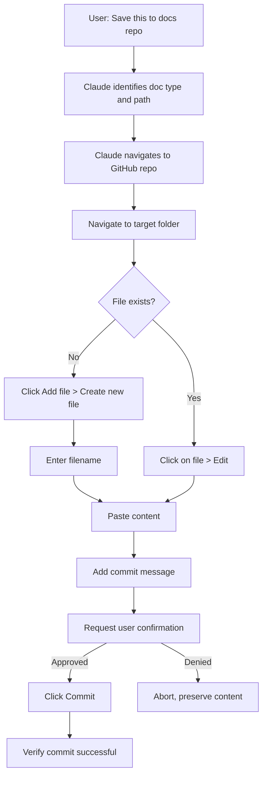

# Skill: Documentation Commit

## Metadata
```yaml
id: SKILL-001
name: documentation-commit
domain: governance
triggers:
  - user creates downloadable artifact
  - user requests to save documentation
  - user says "commit this" or "save to docs repo"
  - user says "push this to GitHub"
```

## Description
Commits documentation artifacts directly to GitHub via browser automation. No downloads or terminal required.

## Inputs
| Input | Required | Description |
|-------|----------|-------------|
| `file_content` | Yes | The document content |
| `doc_type` | Yes | POL, STD, SOP, WI, or SKILL |
| `title` | Yes | Human-readable document title |
| `domain` | Yes | Business domain (from Safari Trace domains) |
| `tags` | No | Array of searchable tags |

## Outputs
File committed directly to GitHub with:
- Proper path and naming convention
- Conventional commit message
- User confirmation before commit

## Naming Convention
```
{doc_type}-{sequential_number}-{kebab-case-title}.md

Examples:
- WI-001-claude-tool-selection.md
- STD-001-documentation-architecture.md
- SKILL-001-documentation-commit.md
```

## Repository Structure
```
/organizational-docs
├── /policies         # POL-XXX
├── /standards        # STD-XXX  
├── /procedures       # SOP-XXX
├── /instructions     # WI-XXX
├── /skills           # SKILL-XXX
│   └── /{skill-name}
│       └── SKILL.md
├── /domains
│   └── /{domain-name}
│       └── /instructions
└── index.yaml
```

## Commit Message Convention
```
docs({doc_type}): {action} {title}

Examples:
- docs(WI): add claude tool selection workflow
- docs(STD): update documentation architecture
- docs(SKILL): add documentation-commit capability
```

## Execution Flow



## Browser Automation Steps

### Create New File
1. Navigate to `github.com/{org}/{repo}`
2. Navigate to target folder
3. Click "Add file" > "Create new file"
4. Enter filename: `{TYPE}-{NUMBER}-{title}.md`
5. Paste document content
6. Enter commit message: `docs({type}): add {title}`
7. **Ask user for confirmation**
8. Click "Commit changes"

### Update Existing File
1. Navigate to file in repo
2. Click pencil icon (Edit)
3. Replace or modify content
4. Enter commit message: `docs({type}): update {title}`
5. **Ask user for confirmation**
6. Click "Commit changes"

## User Confirmation Requirement

Before any commit, Claude must:
1. State the file path and name
2. State the commit message
3. Ask: "Ready to commit this to GitHub?"
4. Wait for explicit approval

## Usage Example

**User:**
> "Save this work instruction to the docs repo"

**Claude:**
> I'll commit this to `/instructions/WI-003-new-workflow.md` with message:
> `docs(WI): add new workflow`
>
> Ready to commit to GitHub?

**User:**
> "Yes"

**Claude:**
> [Navigates to GitHub, creates file, commits]
> Done. Committed WI-003 to organizational-docs.

## Fallback: Terminal Handoff

If browser automation fails or user prefers terminal:
1. Generate heredoc command block
2. User executes in Claude Code
3. See WI-001 for tool selection guidance

---
*This skill enables end-to-end AI-driven documentation management.*
