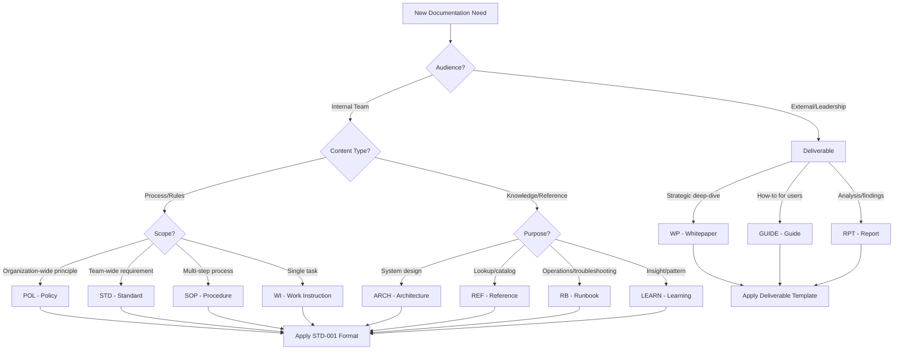
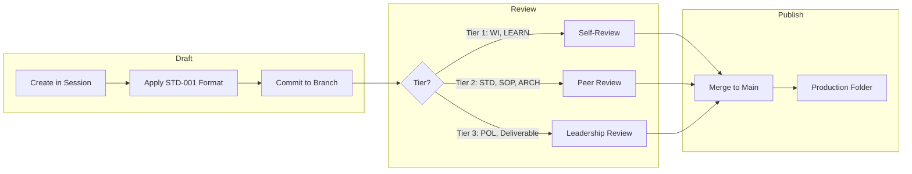

# Skill: Document

## Metadata
```yaml
id: document
name: document
version: 1.0.0
domain: governance
triggers:
  - "document this"
  - "write documentation"
  - "create a doc"
  - "save this to docs"
  - "we need to document"
  - "write up the..."
  - "capture this as..."
  - "formalize this"
  - user creates substantive content worth preserving
auto_invoke: true
```

## Purpose

Guide users through documentation decisions and ensure all docs follow Safari Circuits standards. This skill answers three questions:

1. **Should I document this?** (Decision gate)
2. **What format should I use?** (Type selection)
3. **How do I publish it?** (Workflow)

---

## Decision Tree: Do I Need Documentation?

```
Is this worth preserving beyond this session?
├── NO → Don't document. Conversation is ephemeral.
└── YES → Continue...
    │
    Will someone else need this information?
    ├── NO → Personal note (OneNote, personal backlog)
    └── YES → Continue...
        │
        Is this about HOW we do things or WHAT we know?
        ├── HOW (process/procedure) → Governance Document
        └── WHAT (knowledge/reference) → Knowledge Document
```

---

## Document Type Selection

### Governance Documents (HOW)

| Type | Code | When to Use | Example |
|------|------|-------------|---------|
| **Policy** | POL | Principles, constraints, WHY we do things | POL-001: Data Classification Policy |
| **Standard** | STD | Requirements, specifications, WHAT must be done | STD-001: Documentation Architecture |
| **Procedure** | SOP | Process sequences, FLOW of activities | SOP-001: Incident Response Procedure |
| **Work Instruction** | WI | Task execution, HOW to do one thing | WI-001: Claude Tool Selection |

### Knowledge Documents (WHAT)

| Type | Code | When to Use | Example |
|------|------|-------------|---------|
| **Architecture** | ARCH | System design, technical decisions | ARCH-001: Data Platform Design |
| **Reference** | REF | Lookup tables, catalogs, inventories | REF-001: MCP Catalog |
| **Runbook** | RB | Operational procedures, troubleshooting | RB-001: Database Failover |
| **Learning** | LEARN | Validated insights, best practices | LEARN-001: API Design Patterns |

### Deliverables (External-Facing)

| Type | Code | When to Use | Example |
|------|------|-------------|---------|
| **Whitepaper** | WP | Strategic/technical deep-dives | Context Governance Whitepaper |
| **Guide** | GUIDE | User-facing how-to content | Claude Code Quickstart Guide |
| **Report** | RPT | Analysis, findings, recommendations | Q1 Security Assessment |

---

## Type Selection Flowchart



---

## Format Requirements (STD-001)

Every document MUST have:

### 1. YAML Metadata Header

```yaml
---
id: TYPE-NNN
title: Human-readable title
domain: governance | engineering | data | security | ...
tags: [searchable, terms]
visualization: decision-tree | flowchart | hierarchy-diagram | ...
estimated_time: X min
last_updated: YYYY-MM-DD
---
```

### 2. Atomic Structure

| Principle | Rule |
|-----------|------|
| **One concept** | Max 1 page, one idea per document |
| **Tables > prose** | Use tables for structured information |
| **Scannable** | Headers, bullets, decision logic |
| **Composable** | Reference other docs by ID, don't duplicate |
| **Visualizable** | Include mermaid diagram or diagram hint |

### 3. Naming Convention

```
{TYPE}-{NNN}-{kebab-case-title}.md

Examples:
├── STD-001-documentation-architecture.md
├── WI-002-documentation-lifecycle.md
├── ARCH-001-data-platform-design.md
└── LEARN-001-api-patterns.md
```

---

## Repository Locations

| Document Type | Path |
|---------------|------|
| Policies | `docs/policies/` |
| Standards | `docs/standards/` |
| Procedures | `docs/procedures/` or `runbooks/` |
| Work Instructions | `runbooks/` or `domains/{domain}/instructions/` |
| Architecture | `domains/{domain}/architecture/` |
| Reference | `shared/` or `domains/{domain}/` |
| Runbooks | `runbooks/{category}/` |
| Learnings | `shared/learning/best-practices/` |
| Deliverables | `deliverables/{audience}/` |

**ENFORCED**: All docs go to `C:\Users\dkmcintyre\organizational-docs`. Never OneDrive.

---

## Approval & Publishing Workflow



### Review Tiers

| Tier | Document Types | Reviewer | Turnaround |
|------|----------------|----------|------------|
| **1 - Self** | WI, LEARN, REF, RB | Author | Immediate |
| **2 - Peer** | STD, SOP, ARCH | Team member | 1-2 days |
| **3 - Leadership** | POL, Deliverables | IT Director | 3-5 days |

### Review Checklist

- [ ] YAML metadata complete and valid
- [ ] Follows STD-001 format (atomic, tables, scannable)
- [ ] Naming convention correct
- [ ] No duplicate content (references existing docs)
- [ ] Diagram included or visualization hint provided
- [ ] Placed in correct repository path

---

## Skill Execution

When this skill activates, Claude will:

### Step 1: Identify Documentation Need
```
Claude detects documentation-worthy content or user trigger phrase.
```

### Step 2: Ask Clarifying Questions
```
I see you want to document [topic]. Let me help you choose the right format:

1. **Audience**: Who will read this? (Team / Leadership / External)
2. **Content**: Is this about HOW we do things or WHAT we know?
3. **Scope**: How broad is this? (Org-wide / Team / Single task)

Based on your answers, I'll recommend the document type.
```

### Step 3: Recommend Format
```
Based on your answers, I recommend:

**Type**: STD (Standard)
**Path**: docs/standards/STD-004-{topic}.md
**Review Tier**: 2 (Peer Review)

Ready to draft?
```

### Step 4: Generate Document
```
Claude generates document with:
- YAML metadata header
- STD-001 compliant structure
- Mermaid diagram (if applicable)
- References to related docs
```

### Step 5: Commit Workflow
```
Claude follows SKILL-001 (Documentation Commit):
- Navigates to correct folder
- Creates file with proper naming
- Requests user confirmation
- Commits with conventional message
```

---

## Quick Reference Card

```
┌─────────────────────────────────────────────────────────────┐
│                  DOCUMENT TYPE SELECTOR                      │
├─────────────────────────────────────────────────────────────┤
│                                                             │
│  WHO is the audience?                                       │
│  ├── Internal Team → Governance or Knowledge doc            │
│  └── External/Leadership → Deliverable                      │
│                                                             │
│  WHAT kind of content?                                      │
│  ├── Rules/Process → POL | STD | SOP | WI                  │
│  └── Knowledge/Reference → ARCH | REF | RB | LEARN         │
│                                                             │
│  HOW broad is the scope?                                    │
│  ├── Org-wide principle → POL (Policy)                     │
│  ├── Team requirement → STD (Standard)                     │
│  ├── Multi-step process → SOP (Procedure)                  │
│  └── Single task → WI (Work Instruction)                   │
│                                                             │
├─────────────────────────────────────────────────────────────┤
│  FORMAT: YAML header + atomic structure + tables + diagram  │
│  LOCATION: organizational-docs (NEVER OneDrive)             │
│  NAMING: TYPE-NNN-kebab-title.md                           │
└─────────────────────────────────────────────────────────────┘
```

---

## Integration Points

| Skill/Command | Integration |
|---------------|-------------|
| `/checkpoint` | Validates docs written to correct location |
| `/end-work` | Summarizes documentation created in session |
| `/quick-commit` | Uses SKILL-001 for commit workflow |
| `/context` | Registers new docs in context registry |

---

## Related Documents

- **STD-001**: Documentation Architecture Standard
- **WI-002**: Documentation Lifecycle Management
- **SKILL-001**: Documentation Commit
- **STD-002**: Work Item Lifecycle Governance

---

## Changelog

| Version | Date | Changes |
|---------|------|---------|
| 1.0.0 | 2026-02-05 | Initial draft with decision tree and type selector |

---
*This skill ensures documentation is consistent, discoverable, and governed across the team.*
