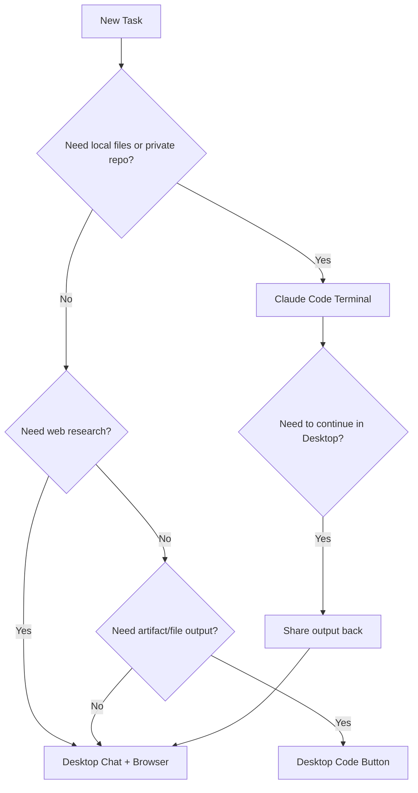

# WI-001: Claude Tool Selection and Handoff

## Metadata
```yaml
id: WI-001
title: Claude Tool Selection and Handoff
domain: productivity
tags: [claude, workflow, tools, handoff]
visualization: decision-tree
estimated_time: 2 min
last_updated: 2025-01-17
```

## Purpose
Select the appropriate Claude interface for a task and hand off between them when needed.

## Decision Logic

| Condition | Tool | Action |
|-----------|------|--------|
| Public web research, strategy, general questions | Desktop Chat | Use browser tools |
| Local files, private repos, run code | Terminal (Claude Code) | Access file system directly |
| Quick artifacts, downloadable files | Desktop Code button | Generate in-browser |
| Task spans both contexts | Desktop → Terminal | Generate handoff prompt |

## Handoff Pattern

When Desktop cannot complete a task (e.g., private repo, local files):

1. **Identify blocker** — What does Claude Code have access to that Desktop doesn't?
2. **Request handoff prompt** — Ask Desktop to generate a context-rich prompt
3. **Execute in Terminal** — Paste prompt into Claude Code
4. **Return results** — Share output back to Desktop if continuation needed

## Handoff Prompt Template

```
Context: [What we're trying to accomplish]
Location: [File path or repo URL]
Task: [Specific action needed]
Output: [Expected deliverable format]
```

## Visual Representation
<!-- AI visualization hint: render as flowchart -->


---
*This work instruction is designed for AI parsing and multi-modal rendering.*
