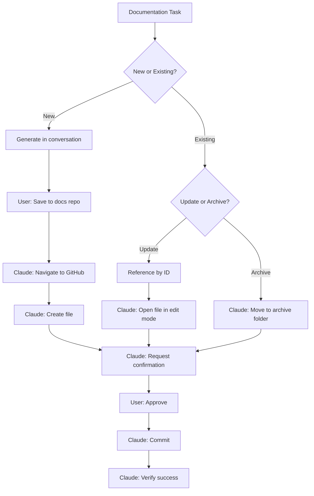

# WI-002: Documentation Lifecycle Management

## Metadata
```yaml
id: WI-002
title: Documentation Lifecycle Management
domain: governance
tags: [documentation, github, commit, workflow, browser]
visualization: flowchart
estimated_time: 2 min
last_updated: 2025-01-17
```

## Purpose
Create, update, and archive documentation using Claude Desktop with browser automation. No downloads or terminal required.

## Prerequisites
- Claude Desktop with Chrome extension
- Logged into GitHub in Chrome
- Access to organizational-docs repository

## Operations

### Create New Document

| Step | Actor | Action |
|------|-------|--------|
| 1 | User | Generate content in Claude Desktop conversation |
| 2 | User | Say: "Save this to docs repo as {type}" |
| 3 | Claude | Navigates to GitHub repo via Chrome |
| 4 | Claude | Creates file with proper naming convention |
| 5 | Claude | Asks for commit confirmation |
| 6 | User | Confirms |
| 7 | Claude | Commits and verifies |

### Update Existing Document

| Step | Actor | Action |
|------|-------|--------|
| 1 | User | Reference doc by ID: "Update WI-001 with..." |
| 2 | Claude | Navigates to file in GitHub |
| 3 | Claude | Opens edit mode |
| 4 | Claude | Makes changes |
| 5 | Claude | Asks for commit confirmation |
| 6 | User | Confirms |
| 7 | Claude | Commits with update message |

### Archive (Soft Delete)

| Step | Actor | Action |
|------|-------|--------|
| 1 | User | Say: "Archive WI-003" |
| 2 | Claude | Creates copy in `/archive/{year}/` |
| 3 | Claude | Deletes original (or adds deprecated flag) |
| 4 | Claude | Asks for confirmation |
| 5 | User | Confirms |
| 6 | Claude | Commits both changes |

## Decision Logic



## Trigger Phrases

| Phrase | Action |
|--------|--------|
| "Save this to docs repo" | Create new file |
| "Commit this as a {type}" | Create with specified type |
| "Update {ID} with..." | Edit existing file |
| "Archive {ID}" | Move to archive |
| "Push this to GitHub" | Create new file |

## Confirmation Required

Claude will always ask before committing:

> I'll commit this to `/{folder}/{filename}` with message:
> `docs({type}): {action} {title}`
>
> Ready to commit to GitHub?

**User must explicitly confirm** (e.g., "yes", "commit it", "go ahead").

## Fallback Options

If browser automation is unavailable:

| Scenario | Fallback |
|----------|----------|
| Chrome extension disconnected | Reconnect or use terminal handoff |
| GitHub auth expired | Re-authenticate in browser |
| Complex multi-file operation | Use Claude Code terminal |

See WI-001 for terminal handoff process.

## Related Documents
- STD-001: Documentation Architecture Standard
- WI-001: Claude Tool Selection and Handoff
- SKILL-001: Documentation Commit Skill

---
*Hard deletes require manual approval. Always archive first.*
